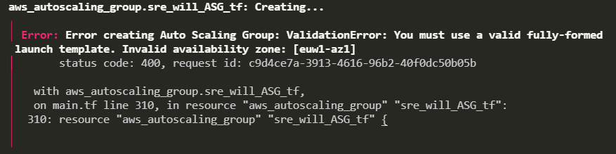

# Terraform
## What is Terraform?
Terraform is an infrastructure as code (IaC) tool that allows you to build, change, and version infrastructure safely and efficiently. This includes low-level components such as compute instances, storage, and networking, as well as high-level components such as DNS entries, SaaS features, etc. Terraform can manage both existing service providers and custom in-house solutions. *(Taken from HashiCorp website)*

---
- Create env var to secure AWS keys
- Restart terminal
- Create a file called main.tf
- Add the code to initialise terraform with provider AWS

```
provider "aws" {
    region = "eu-west-1"

}
```
Run this code to check that the AWS keys are working properly (as environment variables in your system).
## Creating resources on AWS
---

Terraform commands:

- `terraform init` > Initialises Terraform in the current directory
- `terraform plan` > Checks `.tf` files for syntax errors
- `terraform apply` > Executes `.tf` files and applies changes to infrastructure
- `terraform destroy` > Destroys all infrastructure

---
This `main.tf` has the image ID and other options hard-coded:

```
# Let's set up our cloud provider with Terraform

provider "aws" {
    region = "eu-west-1"
}

## Let's launch an EC2 instance using the app AMI
# Need to define all the information required to launch the instance
resource "aws_instance" "app_instance" {
    ami = "ami-04f364e11ef840257"
    instance_type ="t2.micro"
    associate_public_ip_address = true
    tags = {
        Name = "sre_will_terraform_app"
    }
}
```
</details>

---
### Full `main.tf` script using `variable.tf`
Can use `variables.tf` to make the `main.tf` script *soft-coded*. This makes it easier to change variables within the `main.tf` script and it can also be used to protect certain information *(if you add `variable.tf` to your `.gitignore`)*.

To reference variables in the `variable.tf` file, use the variable name with the prefix `var.`.

`varible.tf` example:
```
variable "vpc_id" {
    default = "vpc-123a456b789c"
}
```

*`variable "vpc_id" {` is a variable with the name `vpc_id`, therefore, reference it in `main.tf` with `var.vpc_id`*

<details>
    <summary>Main.tf using variable.tf for soft-coding</summary>

```
## Let's set up our cloud provider with Terraform

provider "aws" {
    region = "eu-west-1"
}

# Create a VPC

resource "aws_vpc" "sre_will_vpc_tf" {
    cidr_block = var.vpc_CIDR_block
    instance_tenancy = "default"

    tags = {
        Name = "sre_will_vpc_tf"
    }
}

# Create an Internet Gateway

resource "aws_internet_gateway" "sre_will_IG" {
    vpc_id = var.vpc_id

    tags = {
        Name = "sre_will_IG_tf"
    }
}

# Create a subnet

resource "aws_subnet" "sre_will_subnet_tf" {
    vpc_id = var.vpc_id
    cidr_block = var.subnet_CIDR_block
    map_public_ip_on_launch = true

    tags = {
        Name = "sre_will_subnet_tf"
    }
}

# Edit security group rules

resource "aws_security_group" "sre_will_app_group" {
    name = "sre_will_app_sg_tf"
    description = "sre_will_app_sg_tf"
    vpc_id = var.vpc_id

    # HTTP port, global access
    ingress {
        from_port = 80
        to_port = 80
        protocol = "tcp"
        cidr_blocks = [var.public_CIDR_block]
    }

    # SSH port
    ingress {
        from_port = 22
        to_port = 22
        protocol = "tcp"
        cidr_blocks = [var.public_CIDR_block]
    }

    # Port 3000 for reverse proxy
    ingress {
        from_port = 3000
        to_port = 3000
        protocol = "tcp"
        cidr_blocks = [var.public_CIDR_block]
    }

    egress {
        from_port = 0
        to_port = 0
        protocol = "-1"
        cidr_blocks = [var.public_CIDR_block]
    }

    tags = {
        Name = "sre_will_app_sg_tf"
    }
}

# Edit the route table (thats created with the VPC)
## Adding the route to the internet gateway

resource "aws_route" "r" {
    route_table_id = var.route_table_id
    destination_cidr_block = var.public_CIDR_block
    gateway_id = var.internet_gateway_id
}

# Let's launch an EC2 instance using the app AMI
## Need to define all the information required to launch the instance

resource "aws_instance" "app_instance" {
    ami = var.ami_id
    instance_type ="t2.micro"
    associate_public_ip_address = true
    vpc_security_group_ids = [
        var.app_security_group_id
    ]
    subnet_id = var.subnet_id

    tags = {
        Name = "sre_will_terraform_app"
    }

    key_name = var.aws_key_name

    connection {
        type = "ssh"
        user = "ubuntu"
        private_key = var.aws_key_path
        host = aws_instance.app_instance.public_ip
    }

    provisioner "remote-exec" {
        inline = [
            "cd app",
            "pm2 kill",
            "pm2 start app.js"
        ]
    }
}
```

---
### Using output values as inputs in `main.tf`
In the previous section, `main.tf` needs to be run multiple times. Each time the script is run, we need to go to AWS and get the ID of what was just created, and put that into the `variable.tf`. This is because a new ID is assigned to the object that each time it is created. We can change `main.tf` such that it extracts the ID from the object that is created and then uses it in the next section. The script for this is:

```
# Let's set up our cloud provider with Terraform

provider "aws" {
    region = "eu-west-1"
}

# Create a VPC

resource "aws_vpc" "sre_will_vpc_tf" {
    cidr_block = var.vpc_CIDR_block
    instance_tenancy = "default"

    tags = {
        Name = "sre_will_vpc_tf"
    }
}

# Create an Internet Gateway

resource "aws_internet_gateway" "sre_will_IG" {
    vpc_id = aws_vpc.sre_will_vpc_tf.id

    tags = {
        Name = "sre_will_IG_tf"
    }
}

# Create a subnet

resource "aws_subnet" "sre_will_subnet_tf" {
    vpc_id = aws_vpc.sre_will_vpc_tf.id
    cidr_block = var.subnet_CIDR_block
    map_public_ip_on_launch = true

    tags = {
        Name = "sre_will_subnet_tf"
    }
}

# Edit security group rules

resource "aws_security_group" "sre_will_app_group" {
    name = "sre_will_app_sg_tf"
    description = "sre_will_app_sg_tf"
    vpc_id = aws_vpc.sre_will_vpc_tf.id

    # HTTP port, global access
    ingress {
        from_port = 80
        to_port = 80
        protocol = "tcp"
        cidr_blocks = [var.public_CIDR_block]
    }

    # SSH port, (set to 0.0.0.0/0 for global access)
    ingress {
        from_port = 22
        to_port = 22
        protocol = "tcp"
        cidr_blocks = [var.public_CIDR_block]
    }

    # Port 3000 for reverse proxy
    ingress {
        from_port = 3000
        to_port = 3000
        protocol = "tcp"
        cidr_blocks = [var.public_CIDR_block]
    }

    egress {
        from_port = 0
        to_port = 0
        protocol = "-1"
        cidr_blocks = [var.public_CIDR_block]
    }

    tags = {
        Name = "sre_will_app_sg_tf"
    }
}

# Edit the route table (thats created with the VPC)
## Adding the route to the internet gateway

resource "aws_route" "sre_will_route_table" {
    route_table_id = aws_vpc.sre_will_vpc_tf.default_route_table_id
    destination_cidr_block = var.public_CIDR_block
    gateway_id = aws_internet_gateway.sre_will_IG.id

}

# Let's launch an EC2 instance using the app AMI
## Need to define all the information required to launch the instance

resource "aws_instance" "app_instance" {
    ami = var.ami_id
    instance_type ="t2.micro"
    associate_public_ip_address = true
    vpc_security_group_ids = [
        aws_security_group.sre_will_app_group.id
    ]
    subnet_id = aws_subnet.sre_will_subnet_tf.id

    tags = {
        Name = "sre_will_terraform_app"
    }

    key_name = var.aws_key_name

    connection {
        type = "ssh"
        user = "ubuntu"
        private_key = var.aws_key_path
        host = "${self.associate_public_ip_address}"
    }

    # provisioner "remote-exec" {
    #     inline = [
    #         "cd app",
    #         "pm2 kill",
    #         "pm2 start app.js"
    #     ]
    # }
}
```
The method for referencing attributes of objects that are newly created is as follows:

```
resource "aws_vpc" "sre_will_vpc_tf" {
    cidr_block = var.vpc_CIDR_block
    instance_tenancy = "default"
```
This creates a VPC with the name `sre_will_vpc_tf`, and it is assigned the CIDR block defined in `variable.tf` > `var.vpc_CIDR_block`

```
resource "aws_internet_gateway" "sre_will_IG" {
    vpc_id = aws_vpc.sre_will_vpc_tf.id
```
This creates an internet gateway called `sre_will_IG`, and it is assigned to the VPC with the ID of `aws_vpc.sre_will_vpc_tf.id`. This corresponds to the VPC created previously. Notice that when the VPC resource is defined, we state the resource type (`aws_vpc`) and its name (`sre_will_vpc_tf`). When defining the VPC ID for the internet gateway, we can refer to this object (`aws_vpc.sre_will_vpc_tf`), and then refer to it's id attribute (`.id`).

To find out what attributes you can reference, go into the `terraform.tfstate.backup` and search for the object you want to reference. The object will have a dictionary of attributes that you are able to reference.

### Using `output.tf`
The `output.tf` will print defined values to the terminal upon the completion of a terraform script. The output variables are defined in the same way as defining output values within a terraform script (described in [Using output values as inputs in `main.tf`](#Using-output-values-as-inputs-in-`main.tf`)).

The following script produces the output shown below:
```
# output.tf > outputs whatever you define to the terminal

output "vpc_id" {
    value = "${aws_vpc.sre_will_vpc_tf.id}"
}

output "internet_gateway_id" {
    value = "${aws_internet_gateway.sre_will_IG.id}"
}

output "subnet_id" {
    value = "${aws_subnet.sre_will_subnet_tf.id}"
}

output "security_group_id" {
    value = "${aws_security_group.sre_will_app_group.id}"
}

output "route_table_id" {
    value = "${aws_vpc.sre_will_vpc_tf.default_route_table_id}"
}
```


---
# Creating a Load Balancer and Auto Scaling group with CloudWatch metrics using Terraform

An Auto Scaling group can be created using Terraform. To do this, we must create:
1. A `launch template` or `launch configuration`
2. An `applciation load balancer`
3. A `target group`
4. A `listener`
5. A `target group attachment` 
    - This final object isn't required when manually creating an Auto Scaling group on the AWS console. I think selecting the target group is attaching it at the same time)

Creating the Auto Scaling group with a `launch configuration` is much easier than using as `launch template`. A large number of people online report that using a `launch template` is fiddly and cumbersome. The main error that I kept getting was that the `launch_template` was not fully configured, specifically the `availability zones` that were assigned to the `launch_template`.

This is the error:



```
########//Load Balancing + Auto Scaling\\########

# Create a launch template

# resource "aws_launch_template" "app_template" {
#     name = "sre_will_app_launch_template"
#     image_id = var.app_ami_id
#     instance_type ="t2.micro"
#     vpc_security_group_ids = [
#         aws_security_group.sre_will_app_group.id
#     ]

#     key_name = var.aws_key_name
# }

# Create a lunch configuration

resource "aws_launch_configuration" "app_launch_configuration" {
    name = "sre_will_app_launch_configuration"
    image_id = var.app_ami_id
    instance_type = "t2.micro"
}

# Create an application load balancer

resource "aws_lb" "sre_will_LB_tf" {
    name = "sre-will-LB-tf"
    internal = false
    load_balancer_type = "application"
    subnets = [
        aws_subnet.sre_will_public_subnet_tf.id,
        aws_subnet.sre_will_private_subnet_tf.id
    ]
    # security_groups = # What SG do you use??

    tags = {
        Name = "sre_will_loadbalancer_tf"
    }
}

# Create an instance target group

resource "aws_lb_target_group" "sre_will_app_TG_tf" {
    name = "sre-will-app-TG-tf"
    port = 80
    protocol = "HTTP"
    vpc_id = aws_vpc.sre_will_vpc_tf.id
    # target_type = instance (by default)

    tags = {
        Name = "sre_will_targetgroup_tf"
    }
}

# Create a listener

resource "aws_lb_listener" "sre_will_listener" {
    load_balancer_arn = aws_lb.sre_will_LB_tf.arn
    port = 80
    protocol = "HTTP"

    default_action {
        type = "forward"
        target_group_arn = aws_lb_target_group.sre_will_app_TG_tf.arn
    }
}

resource "aws_lb_target_group_attachment" "sre_will_app_TG_attachment" {
    target_group_arn = aws_lb_target_group.sre_will_app_TG_tf.arn
    target_id = aws_instance.app_instance.id
    port = 80
}

# Create an Auto Scaling group (from launch template)

# resource "aws_autoscaling_group" "sre_will_ASG_tf" {
#     name = "sre_will_app_ASG_tf"

#     min_size = 1
#     desired_capacity = 1
#     max_size = 3

#     availability_zones = [
#         "euw1-az1",
#         "euw1-az2"
#     ]

#     launch_template {
#         id = aws_launch_template.app_template.id
#         version = "$Latest"
#     }
# }

# Create an Auto Scaling group (from launch configuration)

resource "aws_autoscaling_group" "sre_will_ASG_tf" {
    name = "sre_will_ASF_tf"

    min_size = 1
    desired_capacity = 1
    max_size = 3

    vpc_zone_identifier = [
        aws_subnet.sre_will_public_subnet_tf.id,
        aws_subnet.sre_will_private_subnet_tf.id
    ]

    launch_configuration = aws_launch_configuration.app_launch_configuration.name
}

resource "aws_autoscaling_policy" "app_ASG_policy" {
    name = "sre_will_app_ASG_policy"
    policy_type = "TargetTrackingScaling"
    estimated_instance_warmup = 100
    # Use "cooldown" or "estimated_instance_warmup"
    # Error: cooldown is only used by "SimpleScaling"
    autoscaling_group_name = aws_autoscaling_group.sre_will_ASG_tf.name

    target_tracking_configuration {
        predefined_metric_specification {
            predefined_metric_type = "ASGAverageCPUUtilization"
            # Need to make sure to use valid options here
            # Think the syntax is
            ## ASG for auto scaling group metrics, ALB for load balancing metrics
            ## Name of metric with no spaces
        }
        target_value = 50.0
    }
}
```